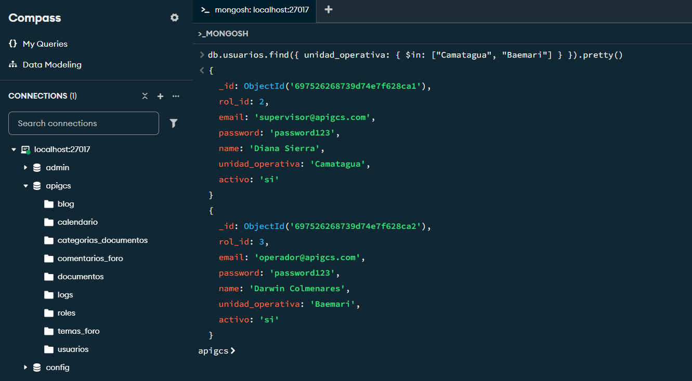
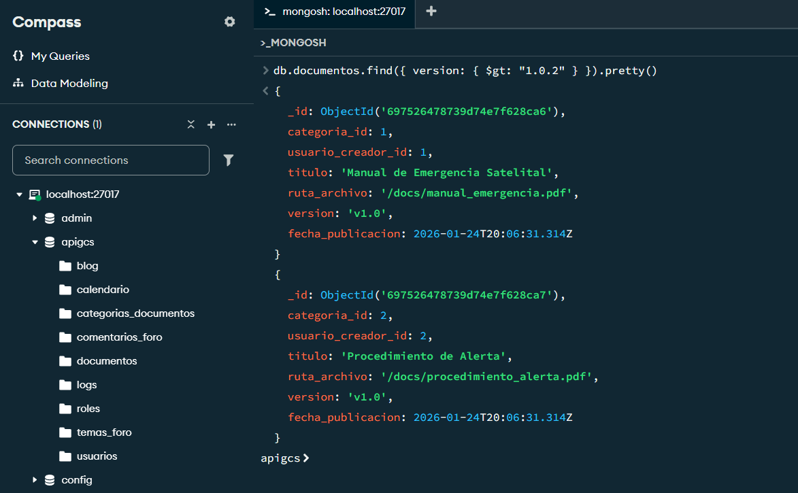
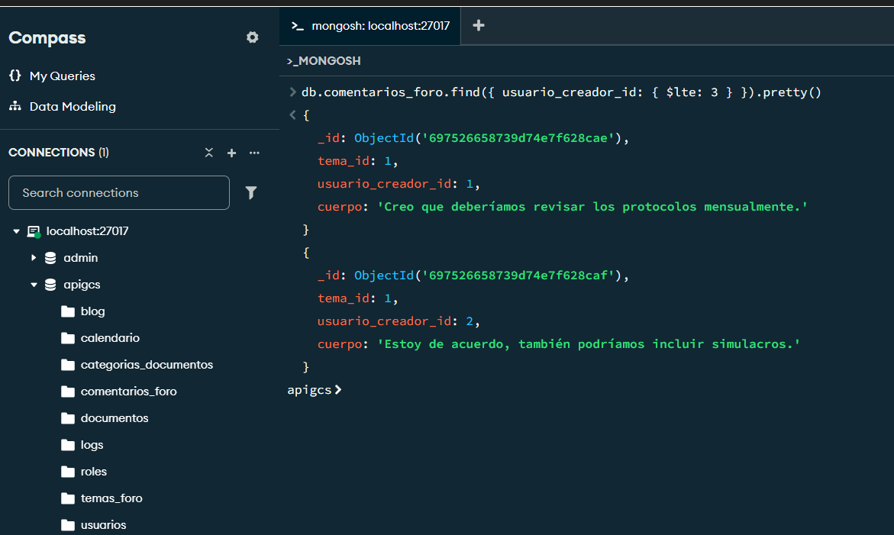
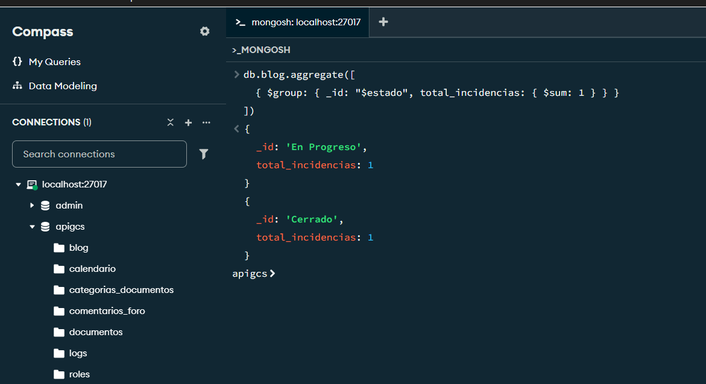
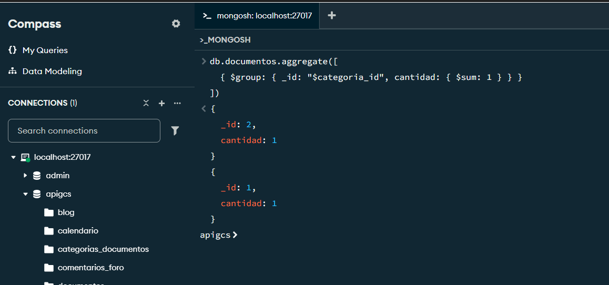
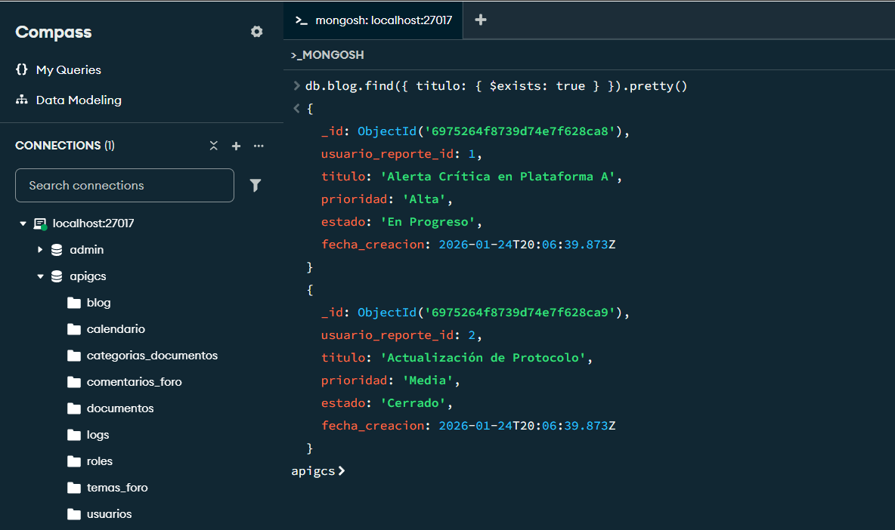
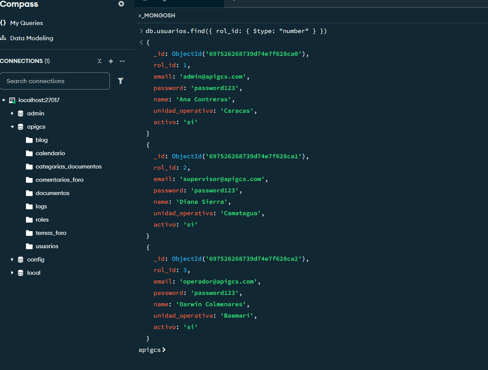
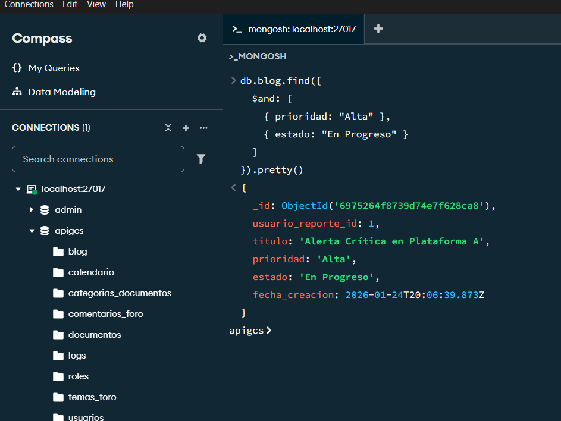
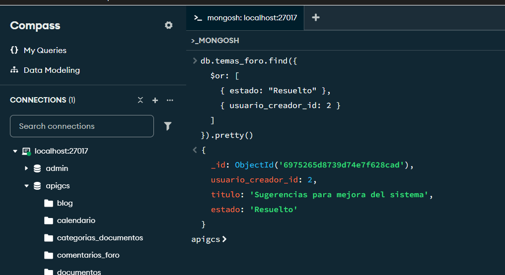
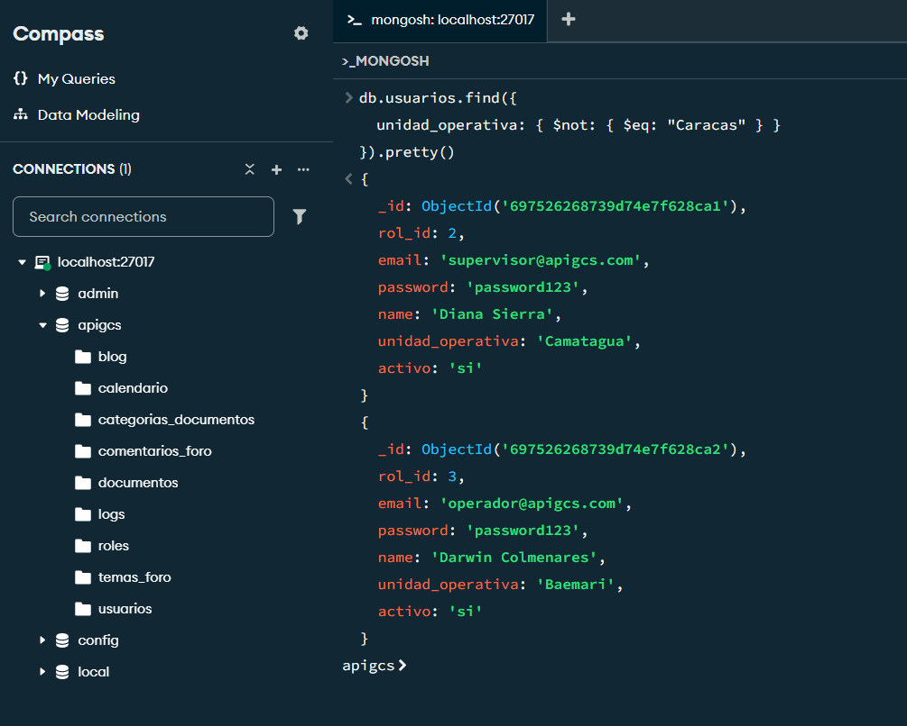

# APIGCS - MongoDB NoSQL Data Management

### Gestión de Contingencias Satelitales

<p align="center">
  
  
  
  
</p>

---

## 📋 Resumen

Proyecto de gestión de datos NoSQL aplicado a un sistema de **Gestión de Contingencias Satelitales (APIGCS)**. Implementa operadores avanzados de MongoDB para filtrado, agregación, validación de esquemas y consultas multicriterio sobre un modelo de datos documental.

### ✨ Capacidades Destacadas

- 🔍 **Filtrado avanzado** de documentos por rangos, tipos y existencia de campos
- 📊 **Agregación de datos** para generación de métricas y reportes operativos
- 🛡️ **Validación de esquemas flexibles** en bases de datos NoSQL
- 🧠 **Consultas complejas** con lógica condicional multi-criterio

### 🎯 Objetivos del Proyecto

- Dominar el uso de operadores de MongoDB para consultas eficientes
- Implementar pipelines de agregación para análisis de datos
- Validar la integridad de esquemas flexibles en entornos NoSQL
- Documentar procesos técnicos con enfoque profesional

---

## 🛠️ Stack Tecnológico

| Componente | Tecnología |
|------------|------------|
| Motor | MongoDB 8.3.2 (NoSQL Documental) |
| Shell | mongosh 2.8.3 + PowerShell |
| GUI | MongoDB Compass |
| Sistema Operativo | Windows 11 Pro |
| Documentación | Markdown + PDF técnico |

---

## 🎯 Operadores Implementados

| Categoría | Operadores | Caso de Uso |
|-----------|------------|-------------|
| **Comparación** | `$gt`, `$gte`, `$lt`, `$lte`, `$in` | Filtrado por versión, rangos de ID y unidades operativas |
| **Agregación** | `$group`, `$sum` | Métricas de incidencias y documentos por categoría |
| **Elementos** | `$exists`, `$type` | Auditoría de esquemas flexibles y validación de tipos |
| **Lógicos** | `$and`, `$or`, `$not` | Consultas multicriterio para reportes operativos |

### 📊 Detalle de Consultas

| # | Operador | Descripción |
|---|----------|-------------|
| 01 | `$in` | Usuarios de unidades Camatagua / Baemari |
| 02 | `$gt` | Documentos con versión > 1.0.2 |
| 03 | `$lte` | Comentarios de foro con creador ID ≤ 3 |
| 04 | `$group` + `$sum` | Conteo de incidencias por estado |
| 05 | `$group` + `$sum` | Documentos subidos por categoría |
| 06 | `$exists` | Verificación de campo `titulo` en blog |
| 07 | `$type` | Validación numérica de `rol_id` |
| 08 | `$and` | Incidencias Alta + En Progreso |
| 09 | `$or` | Temas resueltos o de usuario ID 2 |
| 10 | `$not` | Exclusión de unidad operativa Caracas |

---

## 📁 Estructura del Proyecto

```
apigcs-mongodb-nosql/
├── docs/
│   ├── screenshots/
│   │   ├── 01_operador_in.png
│   │   ├── 02_operador_gt.png
│   │   ├── 03_operador_lte.png
│   │   ├── 04_agregacion_blog.png
│   │   ├── 05_agregacion_documentos.png
│   │   ├── 06_operador_exists.png
│   │   ├── 07_operador_type.png
│   │   ├── 08_operador_and.png
│   │   ├── 09_operador_or.png
│   │   └── 10_operador_not.png
│   ├── doc_comandos_nosql.pdf
│   └── pautas_proyecto.pdf
├── data/
│   └── dump/
│       └── apigcs/
├── queries/
│   ├── 01_operadores_comparacion.js
│   ├── 02_operadores_agregacion.js
│   ├── 03_operadores_elemento.js
│   └── 04_operadores_logicos.js
├── README.md
└── .gitignore
```

---

## 🖼️ Galería de Consultas

### Operadores de Comparación


**Operador `$in`** - Filtrar usuarios por unidad operativa (Camatagua, Baemari):




**Operador `$gt`** - Documentos con versión mayor a 1.0.2:




**Operador `$lte`** - Comentarios de foro con creador_id ≤ 3:




### Operadores de Agregación


**`$group` y `$sum`** - Agrupación en colección blog:




**`$group` y `$sum`** - Contabilización de documentos por categoría:




### Operadores de Elementos


**Operador `$exists`** - Verificar campo `titulo` en colección blog:




**Operador `$type`** - Validar que `rol_id` sea de tipo numérico en usuarios:




### Operadores Lógicos


**Operador `$and`** - Condiciones combinadas:




**Operador `$or`** - Búsqueda multi-criterio:




**Operador `$not`** - Excluir usuarios de la unidad operativa Caracas:



---

## 📋 Evidencia de Ejecución

Las capturas de pantalla de todas las consultas ejecutadas en MongoDB Shell están disponibles en:

👉 [`docs/screenshots/`](docs/screenshots/)

### 💻 Ejemplos de Consultas Ejecutadas

A continuación se muestran las queries ejecutadas en `mongosh` que generaron las capturas de la galería anterior.

#### 1. Operadores de Comparación

**`01_operador_in.png`** — Filtrar usuarios por unidad operativa

```javascript
db.usuarios.find({ unidad_operative: { $in: ["Camatagua", "Baemari"] } }).pretty()
```

**`02_operador_gt.png`** — Documentos con versión mayor a 1.0.2

```javascript
db.documentos.find({ version: { $gt: "1.0.2" } }).pretty()
```

**`03_operador_lte.png`** — Comentarios de foro con creador_id ≤ 3

```javascript
db.comentarios_foro.find({ usuario_creador_id: { $lte: 3 } }).pretty()
```

#### 2. Pipelines de Agregación

**`04_agregacion_blog.png`** — Conteo de incidencias por estado

```javascript
db.blog.aggregate([
  { $group: { _id: "$estado", total_incidencias: { $sum: 1 } } }
])
```

**`05_agregacion_documentos.png`** — Documentos agrupados por categoría

```javascript
db.documentos.aggregate([
  { $group: { _id: "$categoria_id", cantidad: { $sum: 1 } } }
])
```

#### 3. Operadores de Elementos

**`06_operador_exists.png`** — Verificar campo `titulo` en blog

```javascript
db.blog.find({ titulo: { $exists: true } }).pretty()
```

**`07_operador_type.png`** — Validar que `rol_id` sea numérico

```javascript
db.usuarios.find({ rol_id: { $type: "number" } })
```

#### 4. Operadores Lógicos

**`08_operador_and.png`** — Incidencias Alta + En Progreso

```javascript
db.blog.find({
  $and: [ { prioridad: "Alta" }, { estado: "En Progreso" } ]
}).pretty()
```

**`09_operador_or.png`** — Temas resueltos o del usuario 2

```javascript
db.temas_foro.find({
  $or: [ { estado: "Resuelto" }, { usuario_creador_id: 2 } ]
}).pretty()
```

**`10_operador_not.png`** — Excluir usuarios de Caracas

```javascript
db.usuarios.find({ unidad_operativa: { $not: { $eq: "Caracas" } } }).pretty()
```

---

## 🚀 Instalación y Ejecución Local

### Prerrequisitos

- MongoDB Community Server ≥ 8.0
- MongoDB Database Tools (`mongorestore`)
- MongoDB Shell (`mongosh`)
- MongoDB Compass *(opcional, recomendado)*

### 1. Clonar el repositorio

```bash
git clone https://github.com/darwinjcn/apigcs-mongodb-nosql.git
cd apigcs-mongodb-nosql
```

### 2. Restaurar la base de datos

Asegúrate de que MongoDB esté corriendo como servicio. Ejecuta el siguiente comando desde la raíz del proyecto:

```bash
mongorestore --db apigcs data/dump/apigcs
```

### 3. Ejecutar los scripts de queries

```bash
mongosh queries/01_operadores_comparacion.js
mongosh queries/02_operadores_agregacion.js
mongosh queries/03_operadores_elemento.js
mongosh queries/04_operadores_logicos.js
```

### 4. Verificar la instalación

Asegúrate de que el servicio de MongoDB esté corriendo. Conéctate a MongoDB Shell:

```bash
mongosh
```

Dentro de MongoDB Shell, ejecuta:

```javascript
use apigcs
show collections
```

Deberías ver las siguientes colecciones del sistema:

| Colección | Descripción |
|-----------|-------------|
| `usuarios` | Personal técnico por unidad operativa |
| `blog` | Bitácora de incidencias con prioridad y estado |
| `documentos` | Documentación técnica versionada |
| `temas_foro` / `comentarios_foro` | Foro de soporte técnico |
| `calendario`, `categorias_documentos`, `logs`, `roles` | Tablas auxiliares del sistema |

---

## 📚 Documentación

Todo el material documental del proyecto se encuentra organizado dentro del repositorio. A continuación se detalla la ubicación de cada recurso:

| Ubicación | Contenido |
|-----------|-----------|
| `docs/` | Carpeta raíz de documentación técnica |
| `docs/doc_comandos_nosql.pdf` | Informe principal de la evaluación con resultados |
| `docs/pautas_proyecto.pdf` | Pautas y criterios oficiales de la evaluación |
| `docs/screenshots/` | Capturas de pantalla de la ejecución de las consultas |
| `queries/` | Scripts `.js` con las queries de MongoDB documentadas |

---

## 👥 Equipo

- **Ana Contreras**
- **Diana Sierra**
- **Darwin Colmenares**

---

<div align="center">

---

### ⭐ Si este proyecto te fue útil, considera darle una estrella en GitHub ⭐

[](https://github.com/darwinjcn/apigcs-mongodb-nosql/stargazers)

---

<sub>🗓️ <b>2026</b> · Proyecto profesional de gestión de bases de datos NoSQL</sub>
<br>
<sub>Desarrollado con ❤️ por el equipo APIGCS</sub>

</div>
